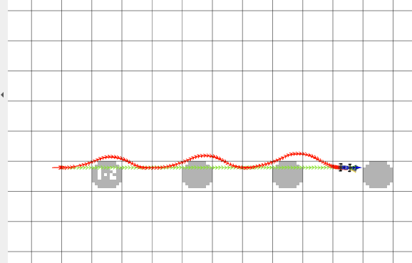
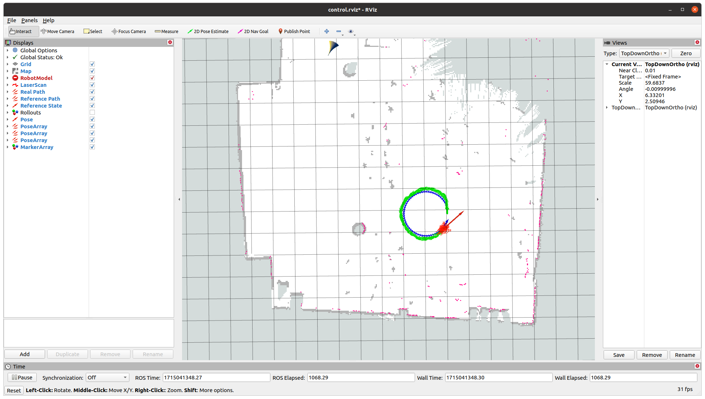

# Project 3: Control 

Replace this with your own writeup! Please place all figures in this directory.

**1)** As we increased the kp gain, the PD controller was more sensitive to changes in direction and could follow turns. However, higher values of kp acted more like a bang bang controller. It was more volatile with changing its direction and could overshoot turns.

**2)**
To tune our PD controller, we changed one parameter at a time. For example, while keeping kd constant, we increased kp until the path matched more accurately. Then, we fixed kp and increased kd. Our final kp gain is 0.8 and our final kd gain is 0.45. As seen in our diagrams, the car matches the default circle, left and wave patterns.

pid_circle

pid_left

pid_wave

**3)**
To tune our lookahead distance for our pp controller, we started at a low value and gradually increased the lookahead until it closely matched the default pp_wave path. As seen in our pp_wave diagram, a lookahead distance of 0.6 is a relatively good sweet spot for the MuSHR car to be able to track the wave and anticipate future turns.

pp_wave

**4)**
pp_small

pp_large

Although the lookahead distance of 0.6 is ideal for pp_wave, we can see from pp_small that the car turns too quickly causing it to go off the default path. Additionally, in pp_large, the car turns too slowly/reacts to a reference point that was too far in the future. It isn’t able to anticipate some of the turns and moves in a straighter line than the default path.

**5)** 
If we decrease the radius of the PP controller, the car steers more aggressively causing the path to have a lot of sharp turns. When we increase the radius of the PP controller, the car steers more gently, thus allowing the path to look more smoothly, however, it will take a longer time for the car to get to the path.

**6)**
K is the number of plans we can compute for. While tuning our MPC, we found that low K values didn’t give the car many different choices/paths to follow. However, if we increased Ke too much/had too many plans, the car switched between following plans too much, causing more volatile/shaky movement. It was also more computationally expensive/slower since we have more plans. T is the number of timesteps we are looking ahead to. For small T values, the car doesn't have a good response to obstacles and responds to collisions too late. If we increase T too much, then the car would have too many paths to explore and would not be able to complete all the computation on time and would choose a nonoptimal path to follow. Our final value for K is 50 and our final value for T is 9.5 which works well for the circle and wave paths. However, the saw is difficult to tune because it has sharp angles/turns. This means that the car must be able to anticipate the turn at exactly the turn location or it would turn too early/late which is not possible due to the constraint of the car. The car must turn earlier or turn later (we decided to have the car turn later). Thus, this is why the car makes a round almost 180 degree turn to be able to return to the path after the sharp turn.

circle

 
wave

saw

**7)**
line

wave

**8)**
If we were to customize our own cost function, we could consider the alignment of the car after it takes the actions relative to the alignment along the path to help the robot find the correct orientation. We could also consider which actions would lead to a smoother ride to minimize jolting to the hardware. Another approach would be to use the distance from the path for cost so that any point far away from the path would have a high cost and close to the path would have low cost. This would favor trajectories following the paths at all points.

**9)**
For PID and PP, low speed settings worked best. For MPC, increasing the speed had a slight negative impact on its performance. Thus, MPC worked best in high speed settings. I think this is because MPC, accounts for the model more and future states so it accounts higher speeds (where it will be in a future position faster).

**10)**

  
The bag files are found in the writeup directory.

<!-- **11)** -->

