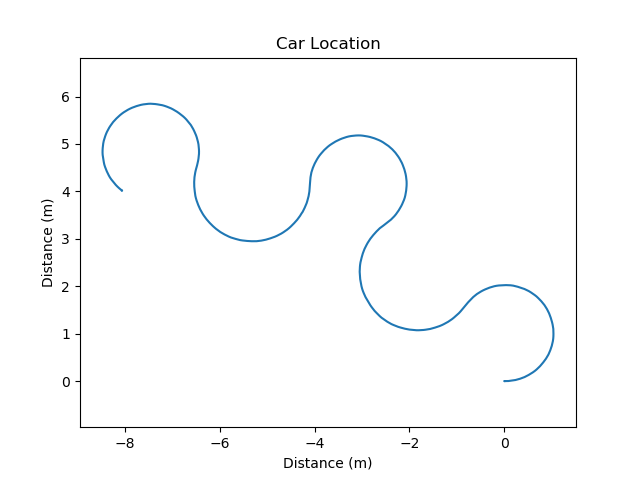

# Project 1: Introduction 

Replace this with your own writeup!

**1)** 
- A Node is the container for subscribers and publishers. It also contains functions that interact with robot hardware. Nodes are like the small brains of a robot. Each can receive, send, and perform actions. Normally, each node is responsible for one or more tasks.

- A Topic is like a radio channel. The name of the topic represents its frequency range. By specifying a topic name, nodes can listen to and send information to the topic. All nodes listening to one topic will receive the information once a node sends information to that topic, and vice versa.

- A publisher is like a radio station that enables nodes to send information to a topic (radio channel).

- A subscriber is like a radio. By specifying a topic name, it can continually listen to a topic like a radio listening to a radio channel. Once it receives information, it can feed the information into a predefined node function. The node function can use the information to perform various tasks.

- Relation: A node uses subscribers and publishers to interact with topics. By listening to and sending information to topics, nodes can communicate with each other.

**2)**
- It launches a bunch of nodes with specified parameters configurations in one command. It enables people to run nodes in more organized manner.

**3)** Rviz screenshot

**4)** runtime_comparison.png

**5)** Include the locations.png and distances.png figures for the plan figure_8.txt.

**6)** Include the locations.png and distances.png figures for the plan tight_figure_8.txt.

