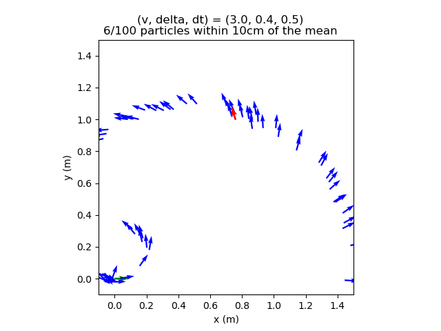
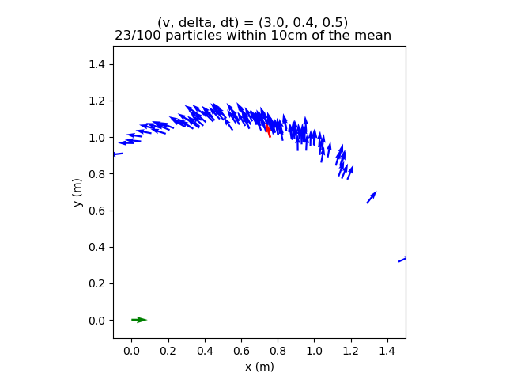
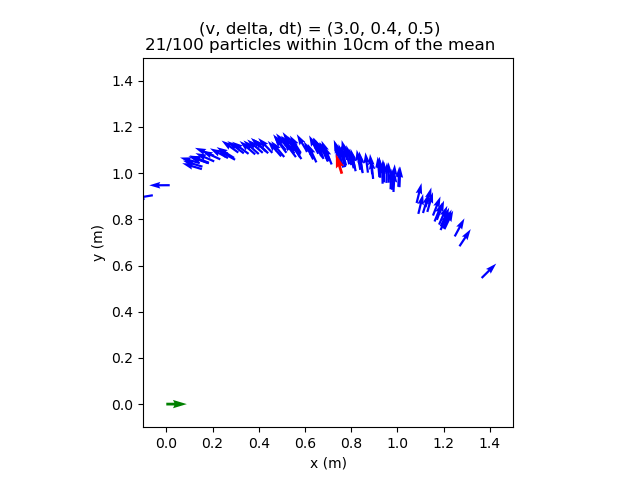
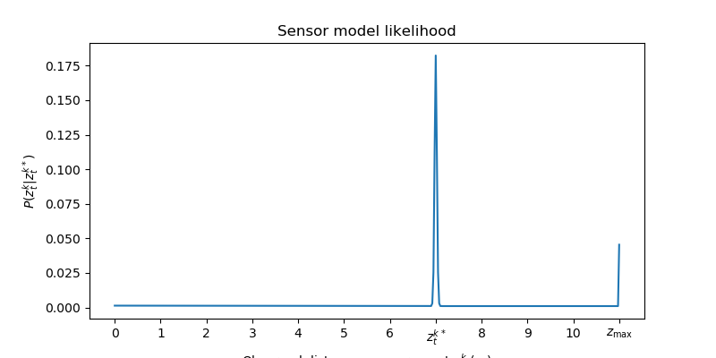
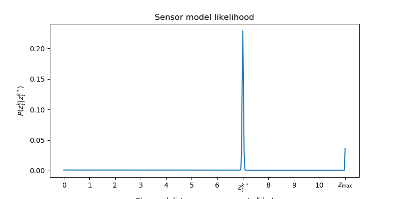
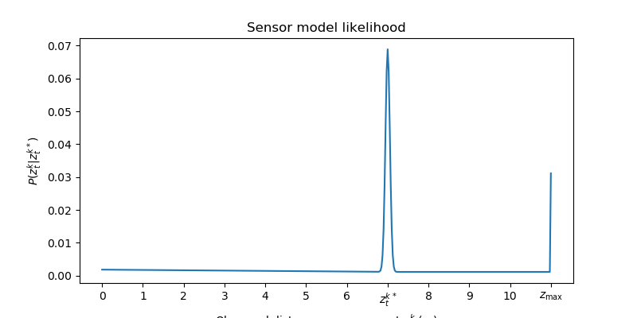
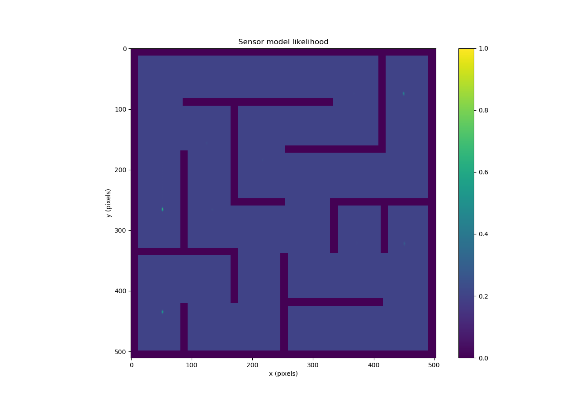
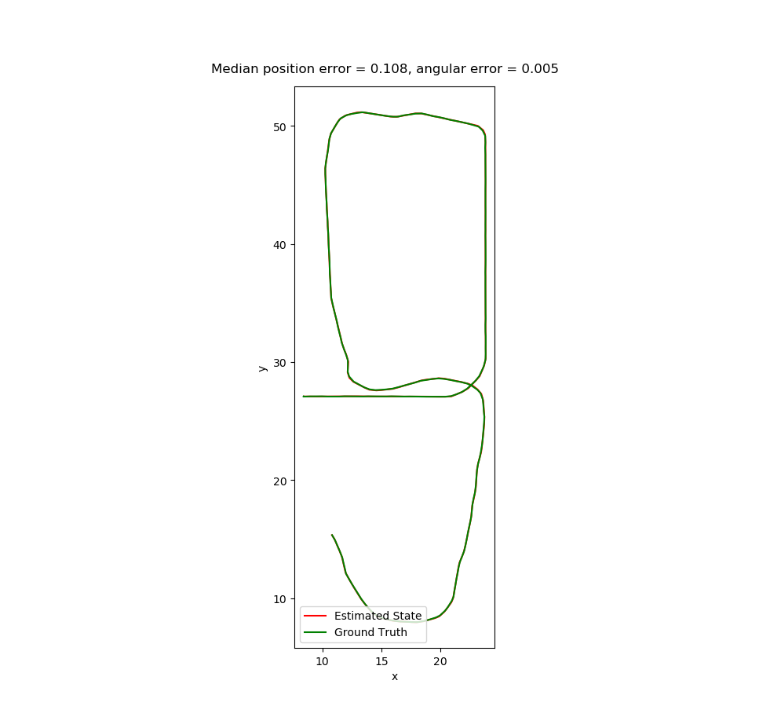

# Project 2: Localization 

**1)** There are more particles within a 10cm radius of the noise free prediction in figure 2 than 3 because there is noise in the predictions and actions, so even slight differences in angle can lead to great distances apart the farther the car travels as the action is applied.

**2)** 
- mm1
We first decrease the x and y to make the blue arrows more centered around the red one in figure 2.

- mm2
Then we changed the delta and theta standard deviation to make the blue arrows more distributed on the same curve in figure 3. This means that with other parameters the same, less delta and theta randomness can decrease the uncertainty of cars' directions in the movements. So the trajectory of the particles will look similar (in mm1, there are some particles representing very curved trajectories).

- mm3
Finally, we decreased the velocity standard deviation so the particles tend to have a similar distance to the starting point. In the image above, we can see there is a rightmost point whose distance to the start is very different from others. By decreasing the velocity standard deviation, we make the rightmost particle closer to other particles. In addition, in the image above, some particles are going more forward and some others are going more backward. In mm3, by decreasing the standard deviation of velocity, we can have the particles' arrowheads and ends more aligned with each other along a curved line.

- Model tuning process: as above

**3)** By using the sensor model’s conditional independence assumption, we assume that the sensor data (laser scan) is independent given our robot’s state and the map. However, this may result in skewed measurements because our single beam laser can be impacted by noise and unexpected objects. In our implementation, we mitigate the drawbacks by anticipating specific types of failures, and add stochasticity accordingly. We check model modes like p_hit, p_short, p_max, p_rand, which check if we have local measurement noise, unexpected objects, sensor failures, or random measurements respectively. 

**4)** 
- sm1 is a baseline of the default parameters to get an idea of where we are starting from. It appeared more confident about it's position in figure 4 in the staff example, but in figure 5 it thinks it is in two different positions compared to the staff solution that just finds one position.
sensor_params:
  hit_std:    1.0
  z_hit:      0.5
  z_short:    0.05
  z_max:      0.05
  z_rand:     0.5

- in sm2, turning up z_hit helped get rid of the second dot found in the position from figure 5.
sensor_params:
  hit_std:    1.0
  z_hit:      0.8
  z_short:    0.05
  z_max:      0.05
  z_rand:     0.5

  

- Finally, in sm3 we turned up the z_short parameter to account for when unexpected obstacles are in the way of the car. This shows in the sensor model likelihood line graph with how there is a slightly larger decline between distances 1 and 7. The points in the shape world plot were also too confident so we increased the standard deviation,
sensor_params:
  hit_std:    2.2
  z_hit:      0.6
  z_short:    0.155
  z_max:      0.05
  z_rand:     0.8

**5)** Maze likelihood plot

**6)** 

**7)** Bagfile recording (2024-04-18-21-51-48)
