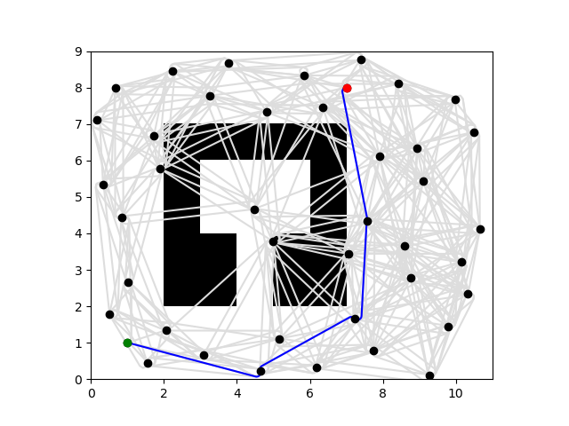
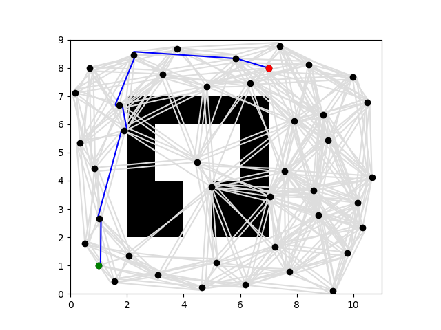
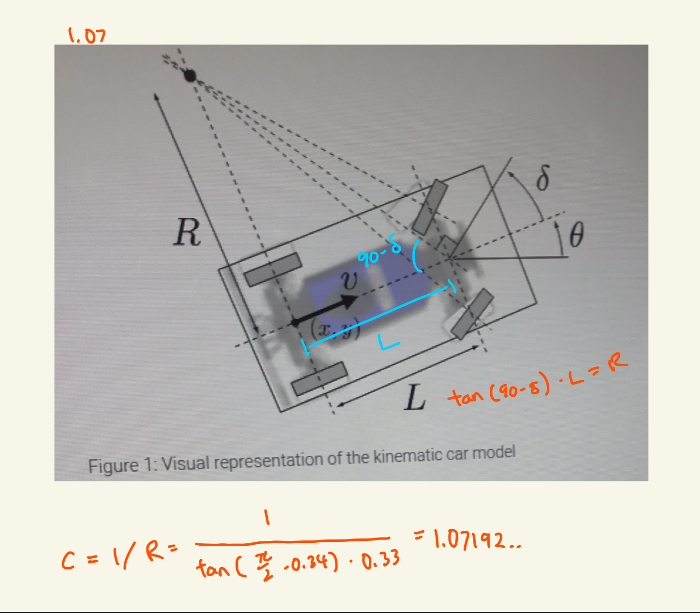
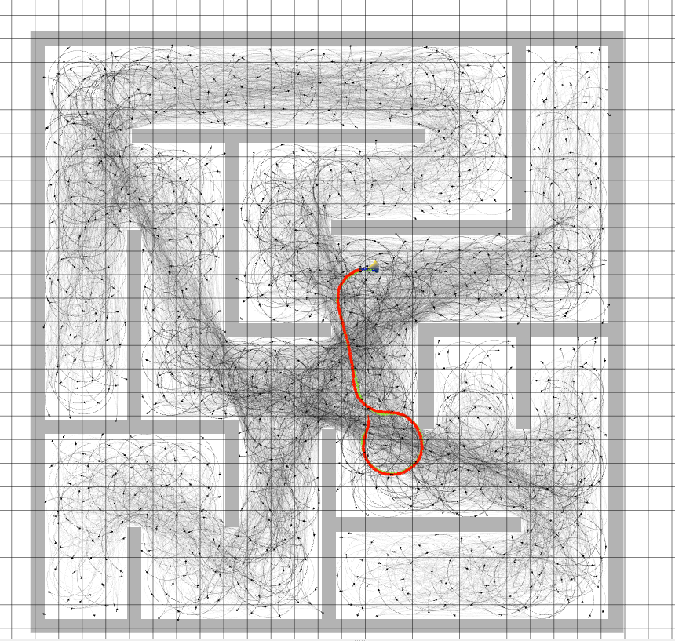
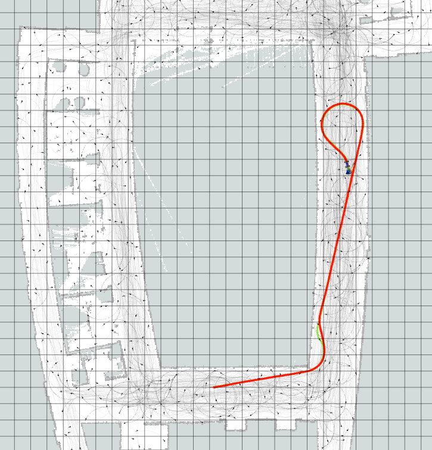

# Project 4: Planning 

Replace this with your own writeup! Please place all figures in this directory.

1. A* shortest path

2. Num vertices constant at 600

| Connection Radius (independent var) | Num Vertices (constant at 600) | Path Length | Planning Time |
|-------------------------------------|-------------------------------|-------------|---------------|
| 100 (default)                       | 600                           | 362.89      | 1.58          |
| 150                                 | 600                           | 362.89      | 3.48          |
| 200                                 | 600                           | 362.89      | 6.098         |
| 500                                 | 600                           | 362.89      | 18.67         |

We can see from the data that as we vary the connection radius, the path length remains the same but the planning time increases exponentially as the connection radius increases linearly

3. Connection radius constant at 100

| Num Vertices (independent var) | Connection Radius (constant at 100) | Path Length | Planning Time |
|--------------------------------|-------------------------------------|-------------|---------------|
| 600 (default)                  | 100                                 | 362.87      | 1.646         |
| 1200                           | 100                                 | 356.33      | 6.37          |
| 2400                           | 100                                 | 347.58      | 25.18         |
| 4800                           | 100                                 | 346.72      | 101.72        |

Too low num vertices -> nodes not reachable

As we increased the number of vertices, the planning time increased exponentially and the path length plateaued around 347.

4. Radius: 100, Num vertices: 1200

| Algorithm  | Num Vertices | Connection Radius | Path Length | Planning Time |
|------------|--------------|-------------------|-------------|---------------|
| A*         | 1200         | 100               | 356.33      | 6.435         |
| Lazy A*    | 1200         | 100               | 356.33      | 0.784         |

Lazy A* had the same path length as A* but was significantly faster at (0.78 for lazy vs. 6.44 for A*)

5. Planning time: 0.005 seconds, Shortcut time: 0.0099 seconds

The shortcut path is closer to the wall and made tighter turns

6. 

### curvature 3
length: 16.086911525242698

### curvature 4.5
length: 14.77307984701639

### curvature 9
length: 13.606245510056146

### curvatrue 15
length: 13.20596227969313

The higher the curvature, the tighter the curves between edges are in the path. The path length also decreases. The path of curvature 3 has larger arcs while the path of 15 has very tight turns.

7. calculations:

Final answer: 1.07193

8. Include an RViz screenshot of the MuSHR car tracking a path in maze_0, as well as the parameters you used to construct the roadmap.

9. Include an RViz screenshot of the MuSHR car tracking a path in cse2_2, as well as the parameters you used to construct the roadmap.

10. When running our planning algorithms with Mushr, with curvature=0.8, we notice that when our car was following paths with an arc, it turned a bit late and would cause a larger arc. Thus, we tuned our mpc to have a larger T, and distance_lookahead value so that it folllows the arc and try to cut it a bit early.